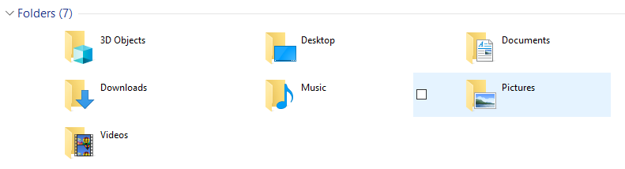

# Edit Folders Listed in This PC in Windows 10

# Problem

In Windows 10, Windows Explorer can start in _This PC_. However, there's a predetermined list of folders that always show up. It would be helpful to modify this list to list favorite folders.  



# Solution

One solution that is easy, but isn't complete, is to add items to the _Network_ section. Simply add a shortcut to the folder at:  
```%appdata%\Microsoft\Windows\Network Shortcuts```  
This can't modify existing folders, and it adds the folder to the _Network locations_ section  

## Remove default folders 

A __better solution__ is to edit the registry to remove these folders. Use this:  
```
[HKEY_LOCAL_MACHINE\SOFTWARE\Microsoft\Windows\CurrentVersion\Explorer\FolderDescriptions\{f42ee2d3-909f-4907-8871-4c22fc0bf756}\PropertyBag]  
"ThisPCPolicy"="Hide"
```
[Source](https://www.tenforums.com/tutorials/6015-add-remove-folders-pc-windows-10-a.html)  
[Complete List of Windows 10 CLSID Key (GUID) Shortcuts](https://www.tenforums.com/tutorials/3123-clsid-key-guid-shortcuts-list-windows-10-a.html)  

## Add custom folder

It's not easy because it requires a lot of steps, and generating a GUID for the custom folder.  
[How to Add a Custom Folder in Explorer Navigation Pane under "This PC"?](http://www.winhelponline.com/blog/add-custom-folder-this-pc-navigation-pane-windows/)  
[Relevant Superuser thread: How can I create a new system folder to show up in “This PC” in Windows 8.1 without additional tools?](https://superuser.com/questions/840790/how-can-i-create-a-new-system-folder-to-show-up-in-this-pc-in-windows-8-1-with/914701#914701)  